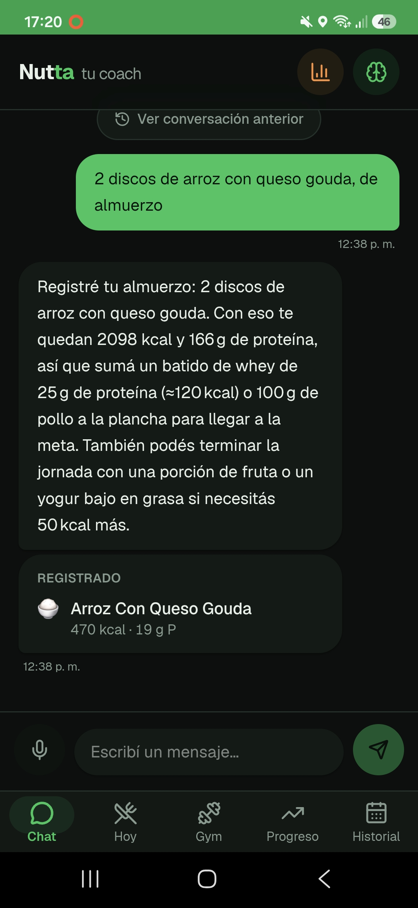
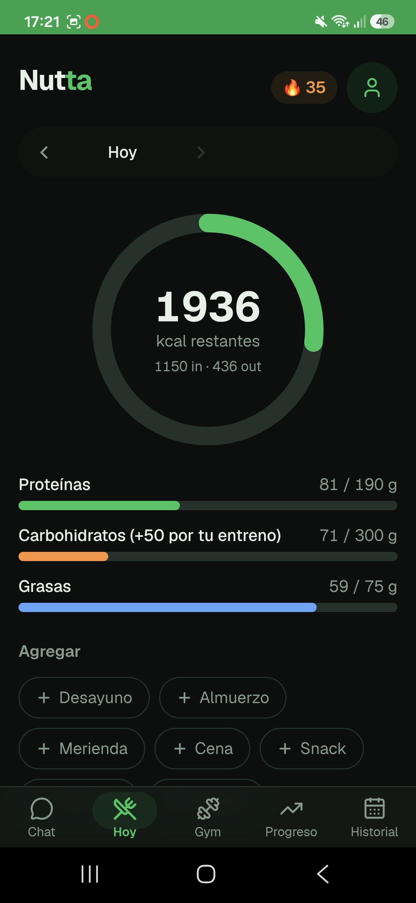
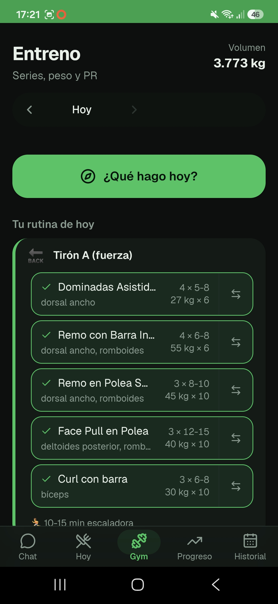

# Nutta 🥗

**Coach de nutrición y entrenamiento con IA.** Le contás lo que comiste o entrenaste como si fuera un chat de WhatsApp, y la app registra calorías, macros, ejercicio, peso, sueño y pasos. Después cruza todo eso para decirte qué conviene hacer hoy.

🌐 **Demo en vivo:** [nutta.vercel.app](https://nutta.vercel.app) · 📖 **Cómo está armada:** [docs/COMO-FUNCIONA.md](docs/COMO-FUNCIONA.md)


> «Desayuné 3 huevos, media palta y un café, dormí 7 horas y me pesé 79»
>
> → se registran la comida con sus macros estimados, el sueño y el peso, sin tocar un formulario.

<p align="center">
  
  
  
</p>
<p align="center"><sub>Chat · Hoy · Gym</sub></p>

---

## Qué hace

- **Registro por chat (texto o voz).** La IA devuelve salida estructurada, validada con un esquema Zod: comidas con macros, ejercicios, peso, agua, sueño y pasos. Cada carga se puede deshacer con un toque.
- **Un coach, no un contador de calorías.** Nutrición, entrenamiento y recuperación se calculan en una sola capa ([`athlete.ts`](src/lib/athlete.ts)). Si entrenaste fuerte y comiste poco, te habla de carbohidratos. Si dormiste 5 horas, eso va antes que cualquier ajuste de macros.
- **Memoria.** Recuerda tus hábitos y comidas frecuentes, así que entiende "lo de siempre".
- **Gimnasio.** Series, repeticiones, PRs, volumen por grupo muscular y un plan semanal. Trae un catálogo de más de 400 ejercicios con imagen ([RepDB](https://repdb.co)), y los pesos sugeridos salen de tu propio historial.
- **Progreso.** Peso con tendencia y predicción, medidas, fotos y detección de recomposición corporal (por ejemplo, si subiste de peso pero bajó la cintura).
- **Lectura del reloj.** Le sacás una captura a la pantalla del smartwatch (Xiaomi, Amazfit…) y un modelo de visión carga el entrenamiento, los pasos o el sueño.
- **Score diario de 0 a 100 explicado**, rachas, logros, metas propias y un análisis semanal.
- **Ideas de comida con IA** para completar los macros que te faltan en el día.
- **Avisos push** con la app cerrada, que un cron de Vercel manda a la mañana y a la noche.
- **Modo vacaciones.** Mientras dura el viaje, las metas pasan a mantenimiento y la racha no se corta.
- **PWA instalable**, funciona offline, tiene modo oscuro y se exporta a CSV o PDF.

## Stack

| Capa | Tecnología |
|---|---|
| Framework | Next.js 16 (App Router, Route Handlers) + React 19 + TypeScript |
| Estilos / UI | Tailwind CSS v4, `motion`, `vaul` (bottom sheets), `lucide-react` |
| Datos + auth | [InstantDB](https://instantdb.com): base en tiempo real con sync offline y login por código mágico |
| IA | Vercel AI SDK + Groq: `gpt-oss` para texto y un modelo de visión para las capturas |
| Notificaciones | Web Push (VAPID) + Vercel Cron |
| Gráficos | Recharts |
| Deploy | Vercel, con deploy automático desde `main` |

## Decisiones técnicas que vale la pena mirar

- **La IA interpreta y el código decide.** Después de la respuesta del modelo, un post-proceso determinístico ([`coachEnrich.ts`](src/lib/coachEnrich.ts)) ajusta cada ejercicio al catálogo: normaliza el nombre para no duplicar PRs y recalcula las calorías con el MET real. El dataset nunca entra al prompt.
- **Un solo modelo del estado del usuario.** El score, los insights, la rutina y el coach leen de la misma función pura ([`athlete.ts`](src/lib/athlete.ts)). Al principio cada módulo miraba solo su parte y se contradecían entre sí.
- **Las rutas de API no confían en el cliente.** Toda entrada se recorta y se valida: tamaño máximo de mensajes e imágenes, tipos y números no negativos. Los errores del modelo vuelven como un 502 controlado.
- **Seguridad por reglas, no por ocultamiento.** El `APP_ID` de InstantDB es público por diseño. Lo que protege los datos son las reglas de [`instant.perms.ts`](instant.perms.ts): cada usuario solo puede leer y escribir sus propias filas y sus propias fotos.
- **Las decisiones descartadas están documentadas.** Este README explica por qué no hay sincronización automática con el reloj y por qué se quitó Open Food Facts.

## Correr el proyecto

Requiere Node 20 o superior.

```bash
npm install
cp .env.example .env.local   # completar las variables
npm run dev                  # http://localhost:3000
```

| Variable | Para qué | Obligatoria |
|---|---|---|
| `GROQ_API_KEY` | Chat, estimación de alimentos, ideas y lectura del reloj ([gratis en console.groq.com](https://console.groq.com)) | Sí, para la IA |
| `GROQ_MODEL`, `GROQ_IDEAS_MODEL`, `GROQ_VISION_MODEL` | Cambiar el modelo que usa cada función | No |
| `NEXT_PUBLIC_VAPID_PUBLIC_KEY`, `VAPID_PRIVATE_KEY`, `VAPID_SUBJECT` | Notificaciones push (`npx web-push generate-vapid-keys`) | Solo para avisos |
| `INSTANT_ADMIN_TOKEN` | Que el cron lea los datos y decida qué avisar | Solo para avisos |
| `CRON_SECRET` | Proteger `/api/push/*` para que solo lo dispare el cron de Vercel | Solo para avisos |

Otros scripts:

```bash
npm run build              # build de producción
npm run lint
npm run data:exercises     # regenera el catálogo de ejercicios desde RepDB
npx instant-cli push perms # sube las reglas de permisos a InstantDB
```

## Estructura

```
src/
├── app/
│   ├── page.tsx            # shell de la app (tabs: Chat, Hoy, Gym, Progreso, Historial)
│   └── api/                # chat, coach, ideas, foods/estimate, watch/scan, push/[slot]
├── components/             # UI por pantalla + primitivas en components/ui
├── lib/
│   ├── athlete.ts          # estado del atleta: la capa que cruza todos los datos
│   ├── coach.ts            # prompts y llamadas a la IA
│   ├── coachEnrich.ts      # post-proceso determinístico de la salida de la IA
│   ├── useNutta.ts         # capa de datos (InstantDB): queries y mutaciones
│   ├── plan.ts, gym.ts     # plan de entrenamiento y progresión
│   └── pushServer.ts       # envío de Web Push desde el cron
└── data/                   # catálogo de ejercicios (RepDB), bundleado
```

## Vincular el reloj (Xiaomi, Amazfit…)

Xiaomi no publica una API, así que la app lee los datos desde una captura de pantalla:

- **Entrenamiento** (actividad, minutos, kcal, pulsaciones, efecto del entrenamiento): **Gym → + Cardio → Escanear captura**.
- **Resumen del día** (pasos, sueño): **Hoy → Bienestar → Escanear reloj**.

El formulario se completa solo y nada se guarda hasta que lo revisás.

<details>
<summary>Por qué no hay sincronización automática</summary>

- **Strava:** desde junio de 2026 su API es paga. Además solo recibe los entrenamientos que arrancás a mano, nunca los pasos ni el sueño.
- **Health Connect:** es una API nativa de Android que una PWA no puede leer. Haría falta empaquetar la app con Capacitor.
- **Google Fit:** Google da de baja sus APIs a fines de 2026.
- **Bluetooth desde el navegador:** el reloj usa un protocolo propietario y cifrado.

</details>

<details>
<summary>Por qué se quitó Open Food Facts</summary>

Bloquea las IPs de datacenter, respondía 503 seguido y devolvía productos que no coincidían con lo que se cargaba. La estimación por IA cubre el mismo caso con menos partes que se pueden romper.

</details>

## Créditos

- Datos de ejercicios de [RepDB](https://repdb.co).

---

Hecho por **Ezequiel Orazi** · [GitHub](https://github.com/Ezzeorazi)
